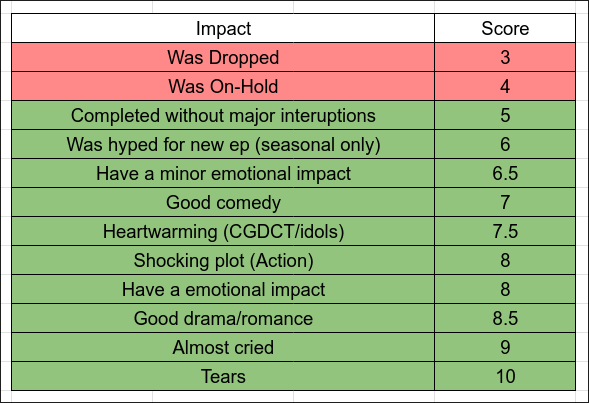

+++
date = '2025-07-16T02:57:33+07:00'
title = 'combine.md'
+++

# Solving a four-year-old problem: finding all combine functions for NRS

It was 2020. I was starting to switch from the "Cry = 10/10" rating system
to a more systematic approach, as described in the title [Anime Rating Rework](https://docs.google.com/spreadsheets/d/1vJv8ojVT1ll6QzWc6JrYl_-vMdbIwaRK5ozxS3ShHOQ/edit?usp=sharing).
With this, a brand new system for anime ranking, with its own complicated rules
are introduced. An anime's score is consisted of several **subscores**, and the
total score is just simply the weighted total of these subscores. No more "if
this anime makes me cry, then it is an instant 10" (looking at you, [Your Lie in
April](https://myanimelist.net/anime/23273/shigatsu_wa_kimi_no_uso)).
The motivation for this is to buff the ongoing series [Love Live!
Nijigasaki Gakuen School Idol Doukoukai](https://myanimelist.net/anime/40879/Love_Live_Nijigasaki_Gakuen_School_Idol_Doukoukai/),
an anime that completely changed my life (for the better or worse). In the old
system, it did not give me much "emotional impact", so it performs not as well
as the top anime. And because of that, taking the excuse of "modernizing the
anime ranking system", people decided to make a rework out of nowhere, giving
birth to the first rework system.

Skipping to 2021, and anime became not as mainstream as other forms of Japanese
medias. Visual novels became a thing after [Aokana](https://vndb.org/v12849) and
[ATRI](https://vndb.org/v27448) (which was famous for being dropped because I
was too busy playing
[E2E](https://www.curseforge.com/minecraft/modpacks/enigmatica2expert)).
Anyways, 2021 anime was kind of in a bad state (not until the YuYuYu meta),
so people thought of ranking things other than anime in the ranking system.
However, this would not work, as the current system divided the total score into
concrete subscores that is purely designed just for anime. For example, 
here is the standard for emotional score.

This would simply give something like Minecraft modpacks a five, even though
modpacks do have some really fun stuff. Basically, I decided to rework the
system yet again, now defining things in a more "extensible" manner, and avoid
using concepts that is anime-exclusive.

For example, NEI (noticable emotional impact) is simply a light emotional impact
the media made on me when I was consuming it. Clearly, this concept can be
applied to many, many things, not just anime. Another change in philosophy is
that impacts are now additive. According to the standard above, an anime with
one "minor emotional impact" and another with ten "minor emotional impact" is
given the same emotional subscore, even though one is significantly better at
making me "feels thing". Clearly, additive impact can solve this, but one needs
to make sure that ten "minor emotional impact" could not overpower something
like an "insane emotional impact", since the latter is much stronger than the
former.

## Introducing: the combine function

The combine function is the heart of the new anime rating system. Oh, right, the
system title does not even have the word "anime", as it is simply called
[NRS](https://github.com/nrs-org/nrs) (New Rating System or New Rework System).
The mission of the combine function is given any amount of numeric inputs, it
must "combine" these inputs to spit out one singular number representing some
sorts of summation over the given input. One trivial combine function is the sum
function:
\[ c_{sum} (x_1, x_2, ..., x_n) = \sum_{k=1}^n x_k. \]
Clearly, this makes impact additive, but we can't control how "additive" it is.
Why we need this, you ask? Consider a very "farmable" subscore, like boredom,
for example. The more interesting a show is, the less boredom I felt when
watching that show, so the more episodes I would watch until dropped. Basically,
when any anime season comes, there are two types of seasonal anime: anime that
was watched every week with great excitement and anime that had one or two
episodes watched before being dropped.

So now, if an anime has 12 episodes, and each episode fully watched gives \(s\)
boredom score, then an anime would have a boredom score of either \(12 s\) or
just about \(1.5s\), which is a huge gap! Basically, the more subscore an anime
got for, the more likely that it would get even more on that particular subscore
in the future, and different subscores have different "farming" rates.

To control the combine function, a proposed idea was to use the \(\mathcal{l}_p\)-norm:
\[ \mathcal{l}_p (x_1, x_2, ..., x_n) = \left(\sum_{k=1}^n x_k^p\right)^{1/p}. \]
And it had been used for 4 years until now. My only complaint is that when \(n\)
is large, this function increases very slowly.

Now, in 2025, as for the time of writing, [Narumi Mona](https://github.com/nrs-org/nrs-impl/discussions/621#discussioncomment-12614023) has been the national waifu for more than 467 days, but the total waifu impact score is just about 2.13 (the second-highest at
1.53 for 180 days). Hmm, now that I'd looked at it, it's not really as bad as I
thought.

## What should the combine function be?

A question that I had for a long long time is that what this combine function
should be. Before arriving at the \(\mathcal{l}_p\) norm above, I first tried
with the [formula](https://osu.ppy.sh/wiki/en/Performance_points#weightage-system)
for calculating total pp in *osu!*, which worked fine (as far as I could
remember), but it has a slight issue: you always have to sort everything before
calculation. Another thing that I hate about this choice of a combine function
is that it is not **associative**. In the perfect system, length-related impacts
(such as waifu and meme impacts, where the score depends on how long a time
interval is) would be chopped into multiple smaller impacts, each representing
an unit of time. So instead of Narumi Mona having an impact of 467 days of being
the waifu, she would have 467 individual impacts of a day being waifu, instead.
This is how things should work, but as you can see, defining 467 impacts is not
a nice choice for performance, especially considering we will have to sort
things out later.

Hence, the choice I made is to pre-combine these 467 impacts into one singular,
compact waifu impact. It will represent 467 impacts, but the impact score will
be the combination of 467 impact days, if that makes sense.

Now, let's do some math. When I said about 467 days, I actually meant 467.15
days, which is not a whole number. And yes, pre-combination can handle
fractional well. Let's see how it does things.

Since every day of being waifu is valued the same, denoted the score as \(s\),
we can calculate the total score of \(n\) waifu days as simply a geometric sum:
\[ s_n = \sum_{k=0}^{n-1} s q^k = s \frac{1-q^n}{1-q}. \]
This sum can be calculated in \(\mathcal{O}(1)\) runtime, and it works for
non-whole number values of \(n\). We just plug in the formula and we are done.

Though, the geometric-weighted-sum approach employed by the pp algorithm is not
a good choice for this approach, because it does not have associativity.
A way to see this is considering an impact with score \(s' > s\) but \(s' <
s_n\). Then, without pre-combination gives,
\[ total = s + q \sum_{k=0}^{n-1} s q^k = s + q s_n, \]
but with combination the total score is,
\[ total' = s_n + q s. \]
Clearly, these are different results.

Hence, our first requirements for the combine function is associativity: we can
pre-combine any set of inputs and it would not change the end results. This is
equivalent to the case where there are 3 inputs:
\[ c(x, y, z) = c(c(x, y), z) = c(c(y, z), x) = c(c(z, x), y). \]
And yes, we are also assuming **commutativity**, too: switching the orders of
the arguments must not change the combined result.

The main reason why the \(\mathcal{l}_p\)-norm above is chosen is that it has
associativity, unlike osu!'s pp algorithm.

For now, let's focus on the case where the inputs are all positive. Actually, in
NRS, negative scores were introduced quite late, because of the whole fiasco
about [Re:Stage!](https://myanimelist.net/anime/38009/Re_Stage_Dream_Days%E2%99%AA)
being unpopular and turned that unpopularity into a weapon to nerf competitors.
The damage is still there, but at least now people are spamming "Bocchi the
Witch" under the comment sections of every 
[Silent Witch](https://myanimelist.net/anime/59459/Silent_Witch__Chinmoku_no_Majo_no_Kakushigoto)
discussion thread without triggering some form of PTSD on me. And
mathematically, the \(\mathcal{l}_p\)-norm thing above is undefined when scores
are negative, so there is no choice there.

Another very important property that I want from the combine function is
homogeneity: basically the function scales. More rigorously, given a positive
number \(\lambda > 0\), then it must hold that:
\[ \lambda c(x_1, x_2, ..., x_n) = c(\lambda x_1, \lambda x_2, ..., \lambda x_n). \]

Even though this looks natural, there is not as much motivation for this as the
associative property. If an anime got factor scores of 4 and 2, it should be
rated two times higher than another with only 2 and 1, that's it.

Now, clearly the \(\mathcal{l}_p\) norm above satisfies this, even in the limiting
cases as \(p \to \infty\). However, one thing that is not clear: is that the
only solutions to the problem?

## Setting the equations

A nice thing about our combine function is that it is entirely determined via
its two-parameter specialization. Given three inputs \(u, v, w > 0\), we can
calculate:
\[ c(u, v, w) = c(c(u, v), w). \]
And for four inputs, we have:
\[ c(u, v, w, x) = c(c(u, v), c(w, x)). \]
Clearly, via pre-combining, we can reduce the problem of finding \(c\) to the
problem of finding the two-parameter version of \(c\). But wait, there's more.
Since \(c\) is homogenous, we can write:
\[ c(x, y) = x c(1, \frac{y}{x}), \]
so if we define \(f(x) = c(1, x)\), then we can fully determine the
two-parameter version of \(c\) from this one-parameter function \(f\).

Then, the homogenous condition can be rewritten as:
\[
    c(c(1, x), y) = c(c(1, y), x)\\
    \iff c(f(x), y) = c(f(y), x)\\
    \iff y c\left(\frac{f(x)}{y}, 1\right) = x c\left(\frac{f(y)}{x}, 1\right)\\
    \iff y f\left(\frac{f(x)}{y}\right) = x f\left(\frac{f(y)}{x}\right),
\]
which is an innocently-looking functional equation like the problems from the IMO.
For the other properties of \(f\), we can easily derive them:
- \(f\) is increasing, since we want the function \(c(1, x)\) to be
    increasing (the more factor score you have, the more score you
    get).
- \(f(0) = 1\), since \(c(0, 1) = 1\): one can think of a zero as an identity
    element of our combine operator.
- \(f(0) \gt x\), since \(c(x, 1)\), the combination of \(x\) with a factor
    score of \(1\), should be at least as large as \(x\) alone.
Here, we might want some of the above inequalities to be strict, but something
like the \(\mathcal{l}_\infty\) does not satisfy this property, so we will just
settle for functions with equalities for now on.

With this, we have our problem, stated as a standard IMO-style functional
equation. I can post it on the Internet and let people solve it for me!

And I [did that](https://math.stackexchange.com/questions/4524490/find-all-function-f-such-that-fyf-fracxy-xf-fracfyx).
However, the only answer I got seems not right (honestly, I haven't put much time
in understanding it). And now that I looked at it, I made a typo on the original equation,
too. No wonder why there are no answers. Since solutions to functional equations
can get very messy in the general case, some regularity conditions can be
imposed to make the problem easier to solve like continuity or
differentiability.

Since then, the hunt stopped. I don't have much time to worry about a singular
function in a (fairly) well-working rating system, so I focus on other stuff.
And it was not until four years later that I finally found out whether there are
any combine functions other than the \(\mathcal{l}_p\) functions above.

## \(t\)-norms: A leap of faith into the unknown

The [Cult of Pure Maths](https://github.com/nrs-org/nrs-impl/discussions/625)
decided that one day, solving for this four-year-old problem is a good idea.
Then, with the help of LLMs, I found out the words "homogeneity" to the problem
in a search-engine-friendly manner. There, I discovered the concept of aggregate
functions, which seemed exactly like something we want.

**Definition**: \(A: \mathbb{I}^n \to \mathbb{I}\) is an aggregation function
if:
- \(A\) is non-decreasing, in each variable.
- \(A\) fulfills the boundary conditions:
    \[
        \inf_{x \in \mathbb{I}^n} A(x) = \inf \mathbb{I}, \text{and}
        \sup_{x \in \mathbb{I}^n} A(x) = \sup \mathbb{I}.
    \]

The second condition looks weird. Since most theories talking about aggregation
function takes \(\mathbb{I} = [0, 1]\), an aggregation function defined that way
is always bounded by \(1\). Of course, fixing \(n\) makes our combine function
bounded too, but the upper limit is not \(1\). Okay, maybe I can scale it or
something, but honestly that makes our function less and less of a combine
function.

I noticed that the concept of \(t\)-norm tends to get discussed a lot along with
aggregation functions, so I took a look at that too. Quoting Wikipedia, we have:

**Definition**: 
A \(t\)-norm is a function \(T: [0, 1] \times [0, 1] \to [0, 1]\)
that satisfies the following properties:
- Commutativity: \(T(a, b) = T(b, a)\),
- Monotonicity: \(T(a, b) ≤ T(c, d)\) if \(a \leq c\) and \(b \leq d\),
- Associativity: \(T(a, T(b, c)) = T(T(a, b), c)\)
- The number 1 acts as identity element: \(T(a, 1) = a\)

This more looks like it! Aside from the last condition and the fact that
everything is still bounded in \([0, 1]\), that is. But, in fact,
we can transform any combine function to a valid \(t\)-norm. To do so, we will
look at what \(0\) do to \(T\). My book explicitly mentions everything to know
about it, but let's prove them rigorously here.

**Theorem**: If \(T\) is a \(t\)-norm, then \(T(0, x) = 0\) for all \(x \in [0,
1]\).

Since \(T(a, 1) = a\) for every \(a\), we can simply set \(a = 0\) and have
\(T(0, 1) = 0\). Since \(T\) is monotonic, we know that \(T(0, x) \leq T(0, 1)\)
for every \(x \in [0, 1]\), which means \(T(0, x) = 0, \forall x \in [0, 1]\).
Hence, QED.

So for \(T\), the element 0 turns everything to itself. Do we have an analogous
for the combine function? If we work on \(\mathbb{R}\), then no, right? But
there is a special number (not really) outside of \(\mathbb{R}\) that actually
satisfy this property for combine functions: \(\infty\). So we want a way to
associate the norm's \(0\) with our \(\infty\), and the norm's \(1\) with our
\(0\) (since 0 is our identity element). A very natural mapping that comes to
mind is the logarithm function. More precisely, we have \(-\log 0 = \infty\) and
\(-\log 1 = 0\). And the negative logarithm also maps \([0, 1]\) to 
\([0, \infty]\), precisely our region!

With this idea, we can try to define:
\[ T(x, y) = c(-\log x, -\log y). \]
But now \(T\) is not associative. If there is something that can "cancel" the
\(\log\)...
\[ T(x, y) = \exp (-c(-\log x, -\log y)). \]

Now that's more like it! Let's try to prove associativity.
\[
\begin{align*}
    T(T(x, y), z) &= \exp (-c(-\log T(x, y), -\log z)) \\
    &= \exp (-c(-\log \exp (-c(-\log x, -\log y)), -\log z))\\
    &= \exp (-c(c(-\log x, -\log y), -\log z))\\
    &= \exp (-c(-\log x, -\log y, -\log z)).
\end{align*}
\]
We can now proceed similarly for other associative combination of \(T\) to get
the similar identities for different combination of \(x, y\) and \(z\).

Hence, we have the following result.

**Theorem**: If \(c\) is a valid combine function (even without homogeneity),
then \(T(x, y) = c(-\log x, -\log y)\) is a \(t\)-norm.

## Archimedean \(t\)-norms and their representations

In this part, I will prove the representation theorem for Archimedean
\(t\)-norm, which is a result that caught my eyes at first when solving for
combine functions. This part will follow the book _Associative Functions:
Triangular Norms and Copulas_, my main reference book for this topic.

First, let's define what an Archimedean \(t\)-norm really is.

**Definition**: A \(t\)-norm \(T\) is Archimedean if for every \(x, y \in (0,
1)\), there exists \(n \in \mathbb{Z}^+\) such that \(T^n (x) < y\),
where \(T^n\) is defined recursively as: \(T^0 (x) = 1, T^{n+1} (x) = T(x, T^n (x))\).

Basically, this means that \(T\) is not "flat" in the sense that it can
"shrink" to any value in \((0, 1)\) given enough iterations. If \(T\) comes
from a combine function, then this means that the combine function has an
opposite
property: given any factor score, no matter how insigificant, if we apply it
enough times, it will eventually "grow" to any value in \((0, \infty)\). Note
that the \(\mathcal{l}_\infty\) norm does not have this property, so its
\(t\)-norm is not Archimedean.

Well, continuous Archimedean \(t\)-norms have a very nice property.

**Theorem**: If \(T\) is a continuous Archimedean \(t\)-norm, then there exists
a decreasing function \(f: [0, 1] \to [0, \infty)\) such that:
\[ T(x, y) = f^{-1} (f(x) + f(y)). \]

The proof of this theorem is very convoluted, but we will still cover them here.
I will split it into multiple parts, so that it is easier to digest.

### \(T\)-powers of a \(t\)-norm \(T\)

Given a \(t\)-norm \(T\), recall that we defined the \(n\)-th power of
\(T\) at a point \(x \in [0, 1]\) as:
\[ T^n (x) = \begin{cases}
    1 & \text{if } n = 0,\\
    T(x, T^{n-1} (x)) & \text{if } n \geq 1.
\end{cases}
\]

Trivially, we know that every \(T^n\) is increasing, and since \(T^n (0) = 0,
T^n (1) = 1\), it maps the whole range \([0, 1]\) to itself. Furthermore, if we
fix the input \(x\), it became decreasing with relation to \(n\):
\[ T^n (x) = T(x, T^{n-1} (x)) <= T(1, T^{n-1}(x)) = T^{n-1} (x), \]
so the there exists a limit:
\[ T^\infty (x) = \lim_{n \to \infty} T^n (x). \]
Furthermore, because of the Archimedean property, this limit must be 0, since if
it is larger than some \(y > 0\), then \(T^n (x) > y\) for all powers of \(x\).

Using this fact, we can prove that \(T\) strictly decreases the input, aside
from the boundary case:
\[ T(x, y) < x, \forall x, y \in (0, 1) \]
Assuming otherwise, then \(T(x, y) = x\) for some \(y\). Then, by simple
induction, we can prove that \(T(T^n (x), y) = x\). But when we take the limit, the
left-hand side becomes \(T(T^\infty (x), y) = 0\), which is a contradiction.
Hence, we have: \(T(x, y) < \min \{x, y\}\).
If we take \(y = x^n\), then we also have that powers of \(x\) strictly decrease
until it reach 0.

Now, we will prove that if \(T^n (x) > 0\), then \(T^n (y) < T^n (x)\).
This seems simple,
but the proof is quite lengthy because of the strict inequality. Now, assuming
the statement is false, so there exists some \(0 < y < x < 1, y^n \geq x^n >
0\). Then, the idea is that there exists some \(z < 1\) such that
\[ y = T(x, z). \]
This is due to the fact that \(T\) is continuous, and that
\(T(x, 0) = 0\) and \(T(x, 1) = x\). Hence, this claim just follows from the
good-old Intermediate Value Theorem. Now, using this, we have:
\[
\begin{align*}
0 < T^n (x) &\leq T^n (y)\\
&= T(y, T^{n-1} (y)) \\
&= T(T(x, z), T^{n-1}(y))\\
&\leq T(T(x, z), T^{n-1}(x))\\
&= T(z, T^n (x))\\
&< \min\{z, T^n (x)\} \leq T^n (x),
\end{align*}
\]
a contradiction.

Now, for every chain \(T^n (x)\), it either hover above 0 and approach 0 as
\(n\) approaches infinity, or it is 0 from some point \(N\) onwards. If the
latter holds, we call \(x\) an nilpotent point of \(T\).

And it turns out that,
if there is some nilpotent point, then every point in \((0, 1)\) is nilpotent.
First, from what we have just proven above, we know that every point below the
nilpotent point is nilpotent, too. And because of the Archimedean property,
we can make any point \(y\) arbitrary small by powering, so the same logic
applies. Hence, every point in \((0, 1)\) is nilpotent.

### Inverse \(T\)-powers

Now, we will look at the inverse of \(T\). Naturally, we would expect it to make
the input larger, opposite of what we see with \(T\), and it turns out to be the
case. And because of a similar argument, we know that the limit of \(T\)-inverse
powers approach 1, similarly to how \(T\)-powers approach 0.

First, we will define inverse powers of \(T\) as follows: \(T^{1/n}\) is defined
as the unique right inverse of \(T^n\) such that it maps 0 to a value \(\alpha_n\)
that we will define later.
Here, we know that \(T^n\) is strictly increasing, but only when its inputs
don't produce 0, so we have to manually define \(T^{1/n}\) there. To make \(T^{1/n}\)
continuous, we have to pick \(\alpha_n = \sup \{x \in [0, 1): T^n (x) = 0\}\).

Then, let's try to prove the opposite of the properties of \(T^n\). First, we
will prove that \(T^{-n} (x)\) is strictly increasing with relation to \(n\).
Assuming otherwise, then there exists some \(x \in (0, 1)\) such that
\[ T^{1/n} (x) \geq T^{1/(n+1)} (x). \]
Then, excluding the trivial cases, we have:
\[ 1 > T^{1/n} (x) \geq T^{1/(n+1)} (x) > \alpha_{n + 1} \geq \alpha_n \geq 0. \]
Applying \(T^n\) to this gives:
\[ x = T^n (T^{1/n} (x)) \geq T^n (T^{1/(n+1)} (x)). \]
But, we have:
\[ x = T^{n + 1} (T^{1/(n+1)} (x)) < T^{n} (T^{1/(n+1)} (x)), \]
which implies that \(x > x\), a contradiction.

Now, to conclude, we will need to make sure that our notations make sense, i.e.
\[
T^m \circ T^n = T^{m n}\\
T^{1/m} \circ T^{1/n} = T^{1/(m n)},
\]
and
\[
T^m \circ T^{1/n} = T^{k m} \circ T^{1/(k n)},
\]
so we can define \(T^{m/n}\) as:
\[
T^{m/n} = T^m \circ T^{1/n},
\]

Let's prove these. Start with the good-old \(T^n\) and prove using induction. For
\(m = 0\) the result is trivial, so we will assume it holds for \(m\) and prove
for \(m + 1\):
\[ (T^{m + 1} \circ T^{n})(x) = T^{m + 1}(T^n(x)) = T(T^m(T^n(x)), T^n(x))
\\= T^{mn + n} (x) = T^{(m + 1)n} (x). \]
Then, for the inverse powers:
\[
T^{mn} \circ T^{1/m} \circ T^{1/n} = T^n \circ T^m \circ T^{1/m} \circ T^{1/n}
\]
is the identity function. To conclude, we need \(\alpha_{mn} = T^{1/m}(T^{1/n}(0))
= T^{1/m}(\alpha_n)\). This follows from the fact that \(T^m (\alpha_{m n}) =
\alpha_n\), which can be proven from the definition of \(\alpha_n\).

For the reduction formula, this trivially follows from the multiplicative
property:
\[ T^{km} \circ T^{1/(kn)} = T^m \circ T^k \circ T^{1/k} \circ T^{1/n} = T^m
\circ T^{1/n}. \]

### Finishing touches

For some \(c \in (0, 1)\), define
\[ g(q) = T^q (c), \forall q \in \mathbb{Q}^+. \]
Then, \(g\) satisfy a very nice additive property:
\[ g(r + s) = T(g(r), g(s)), \forall r, s \in \mathbb{Q}^+, \]
which comes from the usual \(T(T^a, T^b) = T^{a+b}\) property of \(T\).

Now, let's define \(g(0)\) to complete the definition of \(g\). We take:
\[ \lim_{n \to \infty} g\left(\frac{1}{n}\right) = \lim_{n \to \infty}T^{1/n}(c) = 1, \]
so we define \(g(0) = 1\). Now, we will prove that \(g\) defined this way is
continuous, and even stronger, uniformly continuous.

Consider \(c, d \in \mathbf{Q}^+ \cup {0}\). Then, assuming \(c \leq d\),
\[ 
\begin{align*}
|g(c) - g(d)| &= g((c - d) + d) - g(d)\\
&= T(g(d), g(c-d)) - T(g(d), 1).
\end{align*}
\]

Now, to bound this, we simply use the bound given by the uniform continuity of
\(T\). By the limit above, we know that \(g(c-d)\) can get arbitrarily close to
\(1\) given small enough \(c-d\), and because \(T\) is uniformly continuous,
this guarantees that \(T(g(d), g(c-d))\) can get arbitrarily close to
\(T(g(d), 1)\). Hence, we have that \(g\) is uniformly continuous. For a more
rigorous proof, read the book where I took this proof from.

Finally, we have a continuous function \(g\) that works nicely with out \(t\)-norm.
The remaining work is to simply extend \(g\) to the non-negative reals, which
can easily done via taking the infimum:
\[ g(r) = \inf \{g(q): q \in \mathbb{Q}^+ \cup \{0\}, q < r\}. \]
This preserves the continuity of \(g\) and the additive property, so we have:
\[ g(r + s) = T(g(r), g(s)), \forall r, s \geq 0. \]

To conclude, we just need to find an inverse of \(g\), or more precisely,
a pseudo-inverse, since \(g\) is not strictly decreasing (at 0). We won't
discuss such details (since our usage mainly gives strict monotonicity), but
given such \(f = g^{-1}\), we have:
\[ T(u, v) = g(g^{-1}(r) + g^{-1}(s)) = f^{-1}(f(r) + f(s)), \]
exactly what we promised. QED.

## Returning to combining scores

What are we doing in the first place, anyways?

Oh right, we are trying to find a combine function that can be used to combine
NRS scores. After a long proof, we know that what we are looking for is
identifiable from a decreasing function \(f\) with \(f(1) = 0\).

Actually, let's state the Representation Theorem for combine functions. I won't
derive them fully, but here is the result.

**Theorem**: If \(c\) is a combine function, then:
\[ c(x, y) = g^{-1}(g(x) + g(y)), \forall x, y \geq 0, \]
for some continuous, strictly increasing function \(g: [0, \infty] \to [0,
\infty)\) such that \(g(0) = 0\) and \(g(\infty) = \infty\).

If the above formula holds, we will say that \(g\) generates the combine
function \(c\).

Finally, we can tackle the homogeneity condition. We know that
\[
\lambda c(x, y) = c(\lambda x, \lambda y), \forall \lambda > 0,
\]
which is equivalent to:
\[
\frac{1}{\lambda} g^{-1}(g(x) + g(y)) = g^{-1}(g(\lambda x) + g(\lambda y)).
\]
This implies that for a fixed \(\lambda > 0\), both \(g(x)\) and \(g(\lambda x)\)
generate the same \(c\)-norm, so they must be related in some way.

Let's consider the general case.
Assuming that \(g\) generates \(c_1\) and \(g'\) generates \(c_2\), then how
are the two related. Let's say that \(f \leq g\), then maybe we have
some relationship between the two combine functions?

Let's see, \(T \leq T'\) is equivalent to:
\[ f^{-1}(f(x) + f(y)) \leq g^{-1}(g(x) + g(y)). \]
Defining \(h = f \circ g^{-1}, u = g(x), v = g(y)\), then:
\[ f^{-1}(h(u) + h(v)) \leq g^{-1}(u + v). \]
Then, applying \(f\) to both sides gives:
\[ h(u) + h(v) \geq f(g^{-1}(u + v)) = h(u + v), \]
so \(h\) is subadditive.

Then, what if \(T = T'\)? It turns out that we will have:
\[ h(u) + h(v) = h(u + v), \]
so \(h\) would be linear. Hence, \(h(x) = a x\) for some \(a\), and we will
have:
\[f(g^{-1}(x)) = a x \Rightarrow f(y) = a g(y), \forall y \geq 0.\]

Returning to the homogeneity condition, we have:
\[g(\lambda x) = k g(x),\]
with \(k\) being a constant depending on \(\lambda\). Writing this in another
way:
\[g(\lambda x) = k(\lambda) g(x),\]
and by substituting \(x = 1\), we have:
\[g(\lambda) = k(\lambda) g(1).\]
Hence, we can formulate a functional equation:
\[g(\lambda x) = \frac{1}{g(1)} g(\lambda) g(x).\]

This is a derivation of the classical Cauchy's functional equation, which has
solutions of the form:
\[ g(x) = x^p \]
And hence, we arrive at the final form of the combine function:
\[ c(x, y) = (x^p + y^p)^{1/p}. \]
Hence, it turns out that the \(\mathcal{l}_p\) combine function is the only
solutions to our problem! And with this, we have solved a four-year-old problem!

## Wait, where is the \(\mathcal{l}_\infty\) norm?

Basically, it is not an Archimedean \(t\)-norm, so it does not satisfy the
representation theorem above. However, it turns out that the condition of
homogeneity is very strong, and we can actually find every solution to the
combine function problem.

First, let's rewrite our functional equation as one for the \(t\)-norm:
\[ T(x^\lambda, y^\lambda) = T(x, y)^\lambda. \]

Assuming that \(T\) has an interior idempotent, i.e. some \(x \in (0, 1)\)
such that \( T^2(x) = T(x, x) = x \). Then, for every \(y \in (0, 1)\), we have:
\[ T(y, y) = T^2(x^{\log_x y}) = T^2(x)^{\log_x y} = x^{\log_x y} = y. \]
So every \(y\) is an idempotent, which means \(T = \min\), corresponding to
the \(\mathcal{l}_\infty\) norm solution.
You can verify this via:
\[ T(x, y) \geq T(x, x) = x = T(x, 1) \geq T(x, y), \]
given \(x \leq y\).

Otherwise, \(T\) has no interior idempotent, so it is Archimedean. Assuming that
it is not, so there exists some \(x \in (0, 1)\) such that \(T^n(x) \to a > 0\)
as \(n \to \infty\). Now, if we consider \(T^2 (a)\), then by the limiting
property, it must be \(a\), so \(a\) is a idempotent, which is a contradiction
to our assumption! With this, we can apply the above results to conclude that
the combine function must be a \(\mathcal{l}_p\) norm defined above for some
finite \(p\). Hence, combining the two cases, all valid combine functions must
be in the form of the \(\mathcal{l}_p\) norm. QED.
